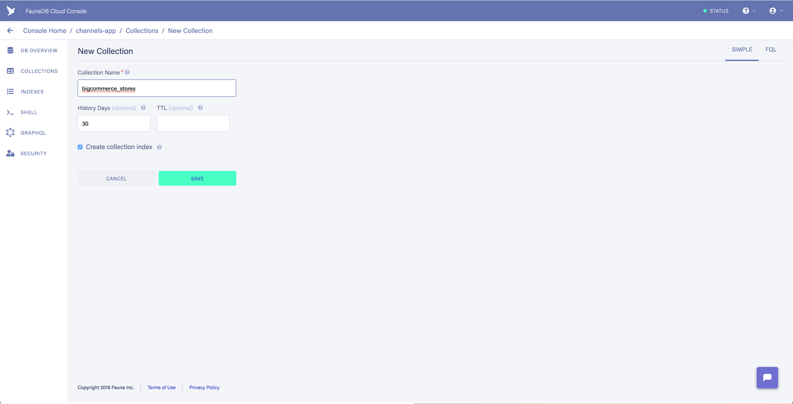

# Overview

The Channels App serves two main purposes, as:

 -  A reference implementation for:
	- Channel, Sites, and Routes APIs 
	- BigDesign React Components
 -	A way to manage the channels connected to a BC storefront and their corresponding sites and routes

## Installation

It can be installed on a BC storefront via insert-url [url].

To get the app running locally:

### Setup Project

Sign Up for netlify: https://app.netlify.com/signup

```bash
npm install netlify-cli -g
```

```bash
netlify init
```

```bash
netlify addons:create fauna
```

```bash
netlify addons:auth fauna
```

### Setup FaunaDB DB and Index

- Log into FaunaDB and go to the collection that was created from netlify
- Create a collection named `bigcommerce_stores`



- Create Index `store_hash` in `bigcommerce_stores`


### Setup ngrok tunnel for app

- Copy `ngrok-sample.yml` to `ngrok.yml`
- Retrieve and replace the auth token in the `ngrok.yml` file

- Set `authtoken` in `ngrok.yml` file with value from https://dashboard.ngrok.com/get-started
- Set hostname to `<username>_channelsdevapp.ngrok.io` in the `ngrok.yml` file.

### Setup BC App

- Log into: https://devtools.bigcommerce.com/my/apps

- Create an app and use the following for the URLS:
  - Auth Callback URL: `<username>_channelsdevapp.ngrok.io/.netlify/functions/bigcommerce_auth`
  - Load Callback URL: `<username>_channelsdevapp.ngrok.io/.netlify/functions/bigcommerce_load`
  - Uninstall Callback URL: `<username>_channelsdevapp.ngrok.io/.netlify/functions/bigcommerce_uninstall`

### Setup .env

Copy `.env_sample` to `.env`

You will need to update and replace the following in `.env`

- BC_CLIENT_ID: BigCommerce App Client Id
- BC_CLIENT_SECRET: BigCommerce App Secret

- BC_AUTH_CALLBACK: Replace with Auth Callback URL from above
- APP_URL= Replace with ngrok hostname from above `https://<username>_channelsappdev.ngrok.io/`

Note: The environment variables in `.env` will also need to be set in Netlify in order for the deployed version to work. [TODO]

### Start Service

In a terminal execute in the root of the project directory to start ngrok: 

```bash
ngrok start --config ngrok.yml site
```

In another terminal execute in the root of the project directory to start the service: 

```bash
yarn netlify:dev
```

The service will live reload on saved changes.  If you want to restart simply stop the `yarn netlify:dev` process and restart it, 
there should be no need to restart ngrok.

Reference: 
- https://docs.fauna.com/fauna/current/start/netlify


